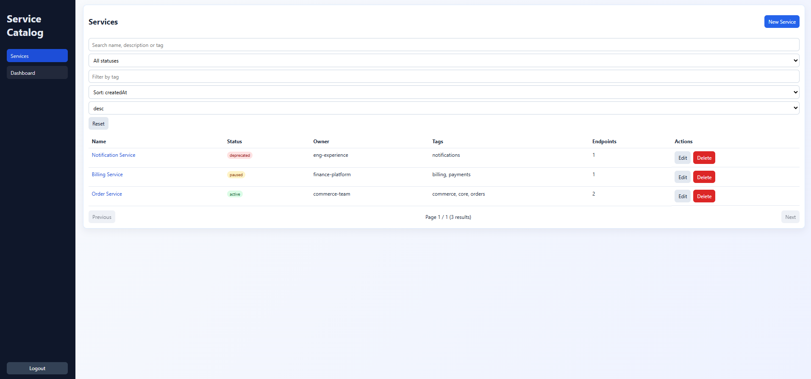

# Service Catalog Monorepo

Mini produit fullstack pour gerer un catalogue de services avec `Vue 3`, `NestJS`, `Prisma`, `SQLite` et `Docker` dans un monorepo `npm workspaces`.

## Apercu

Vue principale de l'application (`/app/services`) :



## Tech stack

- Monorepo: npm workspaces
- Frontend: Vue 3, Vite, TypeScript, Pinia, Vue Router
- Backend: NestJS, TypeScript, Swagger, class-validator
- Base de donnees: Prisma + SQLite
- Qualite: ESLint + Prettier
- Conteneurs: Docker + Docker Compose

## Fonctionnalites

- Auth mock frontend (`/login`) avec guard sur `/app`
- CRUD Services
- CRUD Endpoints lies a un Service
- Filtres, recherche, tri, pagination sur les services
- Dashboard KPI (`servicesByStatus`, `endpointsByAuthType`, totaux)
- Validation backend stricte (DTO + ValidationPipe)
- Swagger auto (`/api/docs`)
- Tests e2e backend sur les cas critiques

## Quick Start

### Docker

Option la plus rapide pour verifier le projet en bout en bout.

```bash
cp .env.example .env
docker compose up --build
```

Si ta machine utilise Compose v1 :

```bash
docker-compose up --build
```

URLs :

- Web: `http://localhost:5173`
- API: `http://localhost:3001/api`
- Swagger: `http://localhost:3001/api/docs`

### Local

```bash
cp apps/api/.env.example apps/api/.env
cp apps/web/.env.example apps/web/.env
npm install
npm run db:migrate
npm run dev
```

`npm run db:migrate` applique les migrations et lance aussi le seed Prisma en mode dev.  
`npm run db:seed` reste disponible si tu veux reseeder manuellement.

URLs :

- Web: `http://localhost:5173`
- API: `http://localhost:3001/api`
- Swagger: `http://localhost:3001/api/docs`

## Configuration

### Racine (`.env`)

```bash
cp .env.example .env
```

Variables :

- `PORT=3001`
- `DATABASE_URL=file:./data/dev.db` pour Docker
- `CORS_ORIGIN=http://localhost:5173`
- `VITE_API_URL=http://localhost:3001/api`

### API locale (`apps/api/.env`)

```bash
cp apps/api/.env.example apps/api/.env
```

`apps/api/.env` utilise `DATABASE_URL=file:./dev.db` pour le mode local.

### Web local (`apps/web/.env`)

```bash
cp apps/web/.env.example apps/web/.env
```

## Commandes utiles

```bash
npm run lint
npm run build
npm run test
npm run format
npm run db:push
npm run db:seed
```

Le workspace `web` ne contient pas encore de tests automatises, donc `npm run test` affiche un placeholder cote frontend.

## Docker

- API: conteneur Node (`apps/api/Dockerfile`) sur une image Debian slim compatible Prisma/OpenSSL
- Web: build Vite puis service statique Nginx (`apps/web/Dockerfile`)
- `VITE_API_URL` est injecte au build web via `docker-compose.yml`
- SQLite est persistee dans le volume `api_data` monte sur `/app/apps/api/data`

## Endpoints API

- `GET /api/health`
- `GET /api/services`
- `POST /api/services`
- `GET /api/services/:id`
- `PUT /api/services/:id`
- `DELETE /api/services/:id`
- `GET /api/services/:serviceId/endpoints`
- `POST /api/services/:serviceId/endpoints`
- `PUT /api/endpoints/:id`
- `DELETE /api/endpoints/:id`
- `GET /api/dashboard`

## Couverture e2e backend

- Health check
- Creation d'un service
- Rejet d'un payload invalide
- Listing services avec search/filter/pagination
- Creation d'un endpoint lie a un service

## How to demo in 5 minutes

1. Lancer le projet en local.
```bash
cp apps/api/.env.example apps/api/.env
cp apps/web/.env.example apps/web/.env
npm install
npm run db:migrate
npm run dev
```
2. Ouvrir `http://localhost:5173` puis se connecter.
3. Aller dans `Services` : creer, editer et supprimer un service.
4. Ouvrir un service : creer, editer et supprimer des endpoints.
5. Aller dans `Dashboard` et verifier les KPIs.
6. Ouvrir `http://localhost:3001/api/docs` pour tester l'API via Swagger.

## Arborescence

```text
.
+-- .dockerignore
+-- .env.example
+-- .eslintrc.cjs
+-- .gitignore
+-- .prettierrc
+-- docker-compose.yml
+-- package.json
+-- tsconfig.base.json
+-- README.md
+-- docs
|   +-- image.png
+-- apps
    +-- api
    |   +-- .env.example
    |   +-- Dockerfile
    |   +-- package.json
    |   +-- tsconfig.build.json
    |   +-- tsconfig.json
    |   +-- prisma
    |   |   +-- schema.prisma
    |   |   +-- seed.ts
    |   |   +-- migrations
    |   |       +-- migration_lock.toml
    |   |       +-- 202602240001_init/migration.sql
    |   +-- src
    |   |   +-- app.module.ts
    |   |   +-- main.ts
    |   |   +-- common/filters/prisma-exception.filter.ts
    |   |   +-- common/constants/catalog.constants.ts
    |   |   +-- health/health.controller.ts
    |   |   +-- prisma/*
    |   |   +-- services/*
    |   |   +-- endpoints/*
    |   |   +-- dashboard/*
    |   +-- test
    |       +-- app.e2e-spec.ts
    |       +-- jest-e2e.json
    +-- web
        +-- .env.example
        +-- Dockerfile
        +-- nginx.conf
        +-- index.html
        +-- package.json
        +-- tsconfig.json
        +-- vite.config.ts
        +-- src/*
```

## Checklist validation

- [ ] `npm run lint` passe
- [ ] `npm run build` passe
- [ ] `npm run test` passe
- [ ] `GET /api/health` retourne `status: ok`
- [ ] CRUD services OK
- [ ] CRUD endpoints OK
- [ ] Filtres/search/pagination services OK
- [ ] Dashboard KPI OK
- [ ] Guard `/app` redirige vers `/login` sans token
- [ ] Etats UX visibles: loading / empty / erreur / toasts
- [ ] `docker compose up --build` ou `docker-compose up --build` demarre API + Web

## Related Projects

- Service Dashboard Microfrontends (React + Webpack Module Federation + NestJS):  
  https://github.com/Therebeu621/service-dashboard-microfrontends
